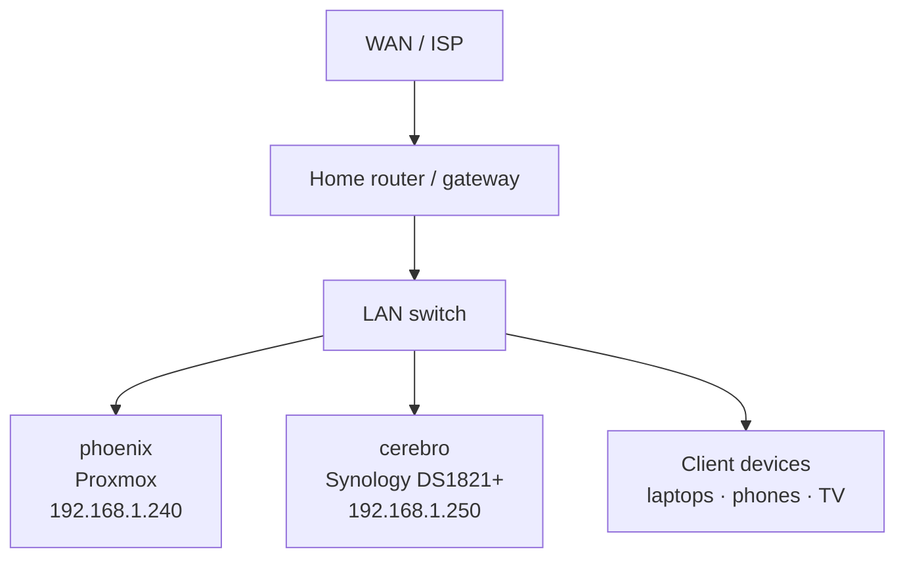

# Home Network

> Physical and logical layout of the LAN. Service placement decisions live in [infrastructure-target-architecture.md](./infrastructure-target-architecture.md); this doc only covers the network fabric.

## Physical Topology

- **One flat subnet** — 192.168.1.0/24. No VLANs today. Segmentation is an open question (below).
- **DHCP handled by the router.** Static leases used for phoenix, cerebro, and anything running a service.

## IP Reservations

| IP | Host | Role |
|---|---|---|
| `192.168.1.240` | phoenix | Proxmox hypervisor, Tailscale subnet router |
| `192.168.1.250` | cerebro | Synology NAS, storage-adjacent services |
| DHCP-assigned | Plex LXC 200 | Reserved via router; update `ansible/inventories/home-network/inventory.yaml` after `terraform apply` |
| DHCP-assigned | Caddy LXC 201 | Same as above |
| DHCP-assigned | Home Assistant VM 100 | Same as above |

Getting the LXC-assigned IPs is a manual step today — see [target-architecture Open Questions](./infrastructure-target-architecture.md#open-questions).

## DNS

- **Authoritative public DNS at Cloudflare** for `mqz.casa`. Managed by Terraform (`terraform/environments/home/dns.tf`).
- **Public records** — `plex.mqz.casa`, `ha.mqz.casa`, `phoenix.mqz.casa` → `192.168.1.240` (phoenix). Cloudflare proxying disabled so LAN clients route directly.
- **Wildcard TLS** — `*.mqz.casa` cert obtained by Caddy on phoenix via Cloudflare DNS-01 challenge. Details in [target-architecture → Reverse Proxy & TLS](./infrastructure-target-architecture.md#reverse-proxy--tls).
- **Tailscale MagicDNS** — remote clients on the tailnet resolve the same `*.mqz.casa` names through phoenix's subnet advertisement, so URLs work identically on LAN and off.

## Tailscale Overlay

- **phoenix advertises `192.168.1.0/24`** to the tailnet. Managed by the `mqz-tailscale` role and Terraform-provisioned auth keys.
- **Cerebro also joins the tailnet** for direct SSH access without exposing DSM to the LAN's edge. Installed manually per `docs/cerebro.md`; codifying alongside cerebro's other bootstrap steps is tracked in issue #13.

## Router / Gateway

- **Not managed by IaC.** Static leases, port forwards (there are none), and DHCP scope are configured in the router's UI.
- **This is intentional** — router config drift is rare and the boot-loop risk of automating a home router is not worth it for a solo dev LAN.

## Open Questions

- **VLAN segmentation** — should IoT devices, management, and trusted clients live on separate VLANs? Would require a managed switch and additional router capability. Not blocking anything today; consider when adding untrusted devices (cameras, IoT).
- **DHCP → DNS integration** — right now DHCP-assigned LXC IPs require a manual inventory update. Options: switch LXCs to static IPs in Terraform, or wire router DHCP → Cloudflare via a script.
- **IPv6** — currently disabled in `mqz-proxmox` role config. Enabling would let Tailscale prefer v6 in some paths but adds firewall surface. No immediate need.
