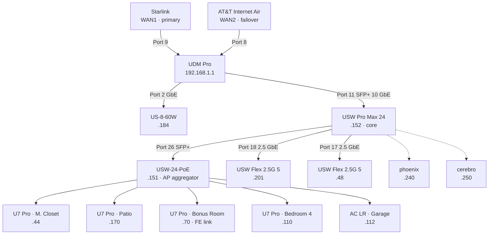

# Home Network

> Physical and logical layout of the LAN. Service placement decisions live in [infrastructure-target-architecture.md](./infrastructure-target-architecture.md); this doc only covers the network fabric.

Network is UniFi end-to-end (UDM Pro controller), dual-WAN with automatic failover, four VLANs provisioned. Bulk of the doc below captures what actually exists in the UniFi controller so future changes have a reference point.

## UniFi Hardware Inventory

| Model | Role | IP | Uplink |
|---|---|---|---|
| UDM Pro | Gateway + controller + firewall | 192.168.1.1 | Starlink (WAN1) + AT&T Internet Air (WAN2) |
| USW Pro Max 24 | Core switch | 192.168.1.152 | UDM Pro Port 11 (SFP+ 10 GbE) |
| USW-24-PoE | AP + downstream aggregator | 192.168.1.151 | USW Pro Max 24 Port 26 (SFP+ GbE) |
| USW Flex 2.5G 5 | Downstream 2.5G switch | 192.168.1.201 | USW Pro Max 24 Port 18 (2.5 GbE) |
| USW Flex 2.5G 5 | Downstream 2.5G switch | 192.168.1.48 | USW Pro Max 24 Port 17 (2.5 GbE) |
| US-8-60W | Small PoE switch | 192.168.1.184 | UDM Pro Port 2 (GbE) |
| U7 Pro AP | Wireless — M. Closet | 192.168.1.44 | USW-24-PoE Port 13 |
| U7 Pro AP | Wireless — Patio | 192.168.1.170 | USW-24-PoE Port 16 |
| U7 Pro AP | Wireless — Bonus Room | 192.168.1.70 | USW-24-PoE Port 12 |
| U7 Pro AP | Wireless — Bedroom 4 | 192.168.1.110 | USW-24-PoE Port 15 |
| UAP-AC-LR | Wireless — Garage | 192.168.1.112 | USW-24-PoE Port 14 |

**Known link issue** — the Bonus Room U7 Pro is currently negotiating at Fast Ethernet (100 Mbps) instead of GbE. Likely cable or port fault; open question below.

## Physical Topology

- **Dashed lines** — phoenix and cerebro are known LAN endpoints but their exact switchport is not captured in this doc yet (open question below).
- **Core is 10 GbE-capable** — the USW Pro Max 24 uplinks to UDM Pro at 10 GbE via SFP+; anything downstream needing >1 GbE can benefit from either the Pro Max's 2.5G ports or the Flex 2.5G switches.

## Internet / WAN

| WAN | ISP | UDM port | Speed | Role |
|---|---|---|---|---|
| WAN1 | Starlink | Port 9 (GbE) | 25 ms latency | Primary |
| WAN2 | AT&T Internet Air | Port 8 (GbE) | 66 ms latency | Failover |

- **WAN Mode: Failover Only.** All traffic uses Starlink until it fails, then flips to AT&T. No load balancing.
- **Starlink IPv4 is CGNAT** (`100.71.165.214` at last check) — no inbound port forwards possible from that WAN. This is why external access uses Tailscale + Cloudflare DNS-01 rather than direct port forwards.

## Networks / VLANs

Four VLANs are configured in UniFi. Two are actively used; two were provisioned for future segmentation and are currently empty.

| Name | VLAN ID | Subnet | Active clients | Intended purpose |
|---|---|---|---|---|
| Default | 1 | 192.168.1.0/24 | ~52 | **Trusted** — everything hardwired + UniFi management (phoenix, cerebro, UniFi devices, primary user machines) |
| LAN Solo | 20 | 192.168.2.0/24 | ~44 | **Untrusted / internet-connected devices** — main WiFi SSID for phones/laptops/IoT |
| MilLANnium Falcon | 10 | 192.168.3.0/24 | 0 | Reserved — likely a **management VLAN** (UniFi devices + hypervisor management) or similar; original intent partly forgotten |
| LANdo Calrissian | 30 | 192.168.4.0/24 | 0 | Reserved for future segmentation — specific role TBD |

Guest access is handled by a UniFi Guest Network SSID (see below), not by its own VLAN entry.

- **L3 Network Isolation (ACL) is OFF** — VLANs today are labels, not enforcement. Any VLAN can reach any other. Segmentation is a future enforcement decision, not a current one.
- **Device Isolation (ACL) is OFF** — no client-to-client isolation within a VLAN.
- **Default Security Posture: Allow All** — new networks default to open.
- **DHCP** — UDM Pro is the DHCP server for all four VLANs.
- **STP: RSTP** at the switch layer.

## Wireless

Three SSIDs, all broadcast from every AP, all WPA2 (dual-band 2.4 GHz + 5 GHz — no 6 GHz SSID today).

| SSID | Attached network | Clients | Intent |
|---|---|---|---|
| It's A Trap | LAN Solo (VLAN 20) | ~39 | Main WiFi — phones, laptops, IoT (untrusted / internet-connected) |
| HothSpot | Default (VLAN 1) | ~9 | UniFi auto-provisioned Guest Network (captive portal / guest isolation) |
| The Force | Default (VLAN 1) | 0 | Standby / trusted — purpose TBD |

**Note on HothSpot placement** — it broadcasts on the Default (VLAN 1) network but should have UniFi's Guest Network flag set, which enforces client isolation and blocks LAN access independently of the underlying VLAN. Confirm the Guest flag is actually enabled; if not, guest clients can currently reach the trusted VLAN. Open question below.

- **Coverage** — 4× U7 Pro (Wi-Fi 7) inside the home + 1× UAP-AC-LR (Wi-Fi 5) in the garage.
- **6 GHz radio unused** — U7 Pro APs support Wi-Fi 7 6 GHz but no SSID targets that band today.
- **All APs broadcast every SSID** — no per-AP SSID isolation.

## Router / Gateway

- **UDM Pro is not managed by IaC today.** VLANs, SSIDs, firewall rules, static leases — all configured through the UniFi UI at `unifi.ui.com`.
- **IaC path exists** — the UniFi controller has a REST API; the community Terraform providers `paultyng/terraform-provider-unifi` and `filipowm/terraform-provider-unifi` can manage VLANs, SSIDs, firewall rules, port profiles, and static leases. Follow-up work tracked in issue #22.
- **Router config drift risk is real** — a bad Terraform apply against the UDM Pro can take the LAN offline. Any future automation needs a rollback plan.

## DNS

- **Authoritative public DNS at Cloudflare** for `mqz.casa`. Managed by Terraform (`terraform/environments/home/dns.tf`).
- **Public records** — `plex.mqz.casa`, `ha.mqz.casa`, `phoenix.mqz.casa` → `192.168.1.240` (phoenix). Cloudflare proxying disabled so LAN clients route directly.
- **Wildcard TLS** — `*.mqz.casa` cert obtained by Caddy on phoenix via Cloudflare DNS-01 challenge. Details in [target-architecture → Reverse Proxy & TLS](./infrastructure-target-architecture.md#reverse-proxy--tls).
- **Tailscale MagicDNS** — remote clients on the tailnet resolve the same `*.mqz.casa` names through phoenix's subnet advertisement, so URLs work identically on LAN and off.
- **Internal DNS resolver** — currently defaults to Cloudflare/UDM upstream. No Pi-hole / AdGuard / self-hosted resolver.

## Tailscale Overlay

- **phoenix advertises `192.168.1.0/24`** to the tailnet — the Default VLAN only. Managed by the `mqz-tailscale` role and Terraform-provisioned auth keys.
- **Cerebro also joins the tailnet** for direct SSH access without exposing DSM to the LAN's edge. Installed manually per `docs/cerebro.md`; codifying alongside cerebro's other bootstrap steps is tracked in issue #13.
- **Other VLANs are not advertised** — if LAN Solo (VLAN 20) or the empty VLANs need remote access, subnet-router config must be extended.

## IaC Options for UniFi

Tracked as follow-up issue #22. The three viable paths:

- **Terraform provider (`paultyng/unifi` or `filipowm/unifi`)** — best fit for this repo since Terraform is already used for phoenix VMs and Cloudflare DNS. Read/write against the UDM Pro's REST API. Supports VLANs, SSIDs, firewall rules, port profiles, user groups, static leases, port forwards.
- **UniFi native backup (`.unf`)** — complete state export, not human-readable, restore-only. Good disaster-recovery complement to IaC but not a replacement.
- **Ansible + `curl` against the API** — possible but rebuilds functionality the Terraform providers already have. Not recommended.

## Open Questions

- **VLAN 10 (MilLANnium Falcon) and VLAN 30 (LANdo Calrissian) purpose** — provisioned but empty. VLAN 10 is likely a management VLAN (UniFi devices + hypervisor management); VLAN 30 role is unremembered. Decide before importing into IaC so imports capture intent, not just current empty state. Also decide whether a real management VLAN should be enforced (would require moving phoenix/cerebro management interfaces off VLAN 1).
- **L3 isolation policy** — L3 Network Isolation and Device Isolation are off. Segmentation without enforcement is decorative. If any VLAN should actually be restricted (guest → internet only, IoT → Home Assistant only, etc.), that becomes a firewall-rule design task.
- **`HothSpot` vs `The Force` SSIDs on the Default VLAN** — HothSpot has 9 clients; The Force has 0. Both are on VLAN 1. Consolidate, or move HothSpot to its own VLAN so guest traffic doesn't share the management LAN?
- **Where do phoenix (.240) and cerebro (.250) plug in?** Not visible in the UniFi device list — likely USW Pro Max 24 or one of the Flex switches. Capture the switch + port when time permits so cable troubleshooting has a map.
- **Bonus Room U7 Pro link speed** — negotiating at 100 Mbps (Fast Ethernet). Likely bad cable or damaged port. Worth a physical inspection.
- **Wi-Fi 7 6 GHz band unused** — U7 Pros support it; no SSID broadcasts on 6 GHz today. Add a 6 GHz-only SSID for modern clients?
- **DNS-based ad blocking / local resolver** — no Pi-hole/AdGuard in the mix. Not blocking anything today; consider when adding untrusted devices.
