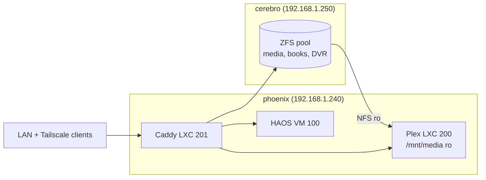

# Infrastructure Target Architecture

> The planning source of truth for how this home network is provisioned and how services are placed. If you want plain English, read [infrastructure-human-summary.md](./infrastructure-human-summary.md) instead.

## How To Use This Document

- **Design decisions live here** — when a placement, tool, or process changes, update this doc in the same PR.
- **Operational commands live in [CLAUDE.md](../CLAUDE.md)** — this doc does not restate `just` recipes or workflow steps.
- **Physical/logical network layout lives in [home-network.md](./home-network.md)** — this doc references it rather than duplicating.

## High-Level Goals

- **Any host re-provisioned with ≤3 commands** — bare hardware to running services should be a scripted, documented path with no undocumented manual steps.
- **No service state lives only in a UI** — Portainer is for observing containers, not defining them; every running container comes from a compose fragment in this repo.
- **All secrets in Ansible Vault** — no plaintext credentials committed; access mediated by `~/bin/op-vault` calling the 1Password CLI.
- **Docs match reality** — if this doc and the code disagree, one of them is a bug.
- **Test locally first** — CI is a gate, not a debugging tool ([CLAUDE.md → CI Discipline](../CLAUDE.md#ci-discipline)).

## Decision Log

| Topic | Decision | Consequence |
|---|---|---|
| Hypervisor | Proxmox VE 9.x on phoenix | Bare-metal install via prepared ISO (see `images/`); one-time manual USB flash |
| Storage host | Synology DS1821+ (cerebro) — 64 GB RAM, ZFS pool | Media, books, DVR recordings all live here; other hosts NFS-mount read-only |
| Reverse proxy | Caddy with Cloudflare DNS-01 wildcard | Single `*.mqz.casa` cert; no ports exposed to the internet |
| Overlay network | Tailscale subnet router on phoenix | Remote access to LAN services via the same DNS names |
| Container runtime on Synology | Docker via Synology's Container Manager package | Runs on stock DSM; no third-party install path |
| Service deploy pattern on cerebro | Ansible + `ironicbadger.docker_compose_generator` + `docker compose up` | Portainer stays for read-only UI observation; deploys come from git |
| Testing | Molecule + Docker (`geerlingguy/docker-debian12-ansible`) | No local Proxmox needed to iterate on roles |
| Secret storage | Ansible Vault with 1Password-backed password | Vault password lookup is `~/bin/op-vault` |

## Current State

- **phoenix (192.168.1.240)** — Proxmox 9.x host. Running: Home Assistant OS (VM 100), Plex (LXC 200), Caddy (LXC 201), Tailscale subnet router. Managed by `mqz-proxmox`, `mqz-plex`, `mqz-caddy`, `mqz-tailscale`.
- **cerebro (192.168.1.250)** — Synology DS1821+ NAS. Running: Portainer, Channels DVR + eplustv + pluto, IPTV Boss, OliveTin + static-server, Calibre-Web-Automated, acme.sh. **All deployed via manual copy-paste into Portainer UI.** Compose fragments exist at `ansible/services/cerebro/**/compose.yaml` but Ansible does not apply them yet.
- **dazzler (historical)** — original host name planned for what is now the Plex LXC (200) on phoenix. Stale references in `ansible/inventories/home-network/inventory-setup.yaml`; cleanup tracked in issue #18.

## Guiding Principles

- **Data gravity** — services that read/write large media or user libraries live on cerebro next to the ZFS pool. Plex is the deliberate exception because iGPU/QuickSync lives on phoenix; media is mounted via NFS read-only.
- **External-facing services on the hypervisor** — reverse proxy (Caddy) and daily-driver user services (Home Assistant, Plex) live on phoenix so cerebro can be reprovisioned/rebooted without taking the front door down.
- **NAS stays focused** — cerebro runs only services with a real reason to be there: data-adjacent, Synology-specific (acme.sh for DSM certs), or hardware-locked (Synology addons).
- **Manual once, automated forever** — the one manual step per host is documented and everything after it is a `just` recipe. Portainer's bootstrap on cerebro is the current gap; codifying it is tracked in issue #13.
- **UI observation, not UI ownership** — Portainer stays as a container dashboard. Deploys always come from `docker compose up` driven by Ansible, not the Portainer web UI.
- **Local test before CI** — every Ansible role has a Molecule scenario and lint passes locally before push. Details in [CLAUDE.md → CI Discipline](../CLAUDE.md#ci-discipline).

## Target End State: Service Placement Matrix

| Service | Host | Type | Deployed? | Rationale |
|---|---|---|---|---|
| Plex Media Server | phoenix | LXC 200 | Yes (TF + Ansible) | Needs iGPU/QuickSync; NFS-mounts media from cerebro |
| Home Assistant OS | phoenix | VM 100 | Yes (TF + manual qcow2 import) | HAOS distributed as VM image |
| Caddy | phoenix | LXC 201 | Yes (TF + Ansible) | External-facing reverse proxy; wildcard TLS via DNS-01 |
| Tailscale subnet router | phoenix | host | Yes (Ansible) | Advertises `192.168.1.0/24`; kernel-level networking |
| Portainer | cerebro | container | Yes (Ansible-native via `mqz-cerebro`) | Read-only UI for cerebro's Docker daemon |
| Channels DVR (+ eplustv + pluto) | cerebro | container | Manual via Portainer (issue #15) | DVR records to NAS storage |
| IPTV Boss | cerebro | container | Manual via Portainer (issue #15) | Feeds Channels DVR |
| OliveTin + static-server | cerebro | container | Manual via Portainer (issue #15) | Integrates with Portainer API on cerebro |
| Calibre-Web-Automated | cerebro | container | Manual via Portainer (issue #15) | Book library on NAS storage |
| acme.sh | cerebro | container | Manual via Portainer (issue #15) | Renews DSM certs — Synology-specific |
| Code-Server | cerebro | container | Stub only | Placeholder; cerebro has 64 GB RAM to spare |
| Syncthing | cerebro | container | Yes (Ansible-native via `mqz-cerebro`) | Reference implementation of the Ansible-native cerebro deploy pattern |

## Runtime Tiers

- **Tier 0 — Edge** — must be up for anything external to work. Caddy (phoenix LXC 201). If this is down, remote access breaks; Home Assistant automations that call external APIs may still work.
- **Tier 1 — Core** — daily user-facing services. Home Assistant, Plex. If these are down, quality of life suffers immediately.
- **Tier 2 — Adjacent** — nice to have. Channels DVR + IPTV Boss + OliveTin, Calibre, Code-Server. If down, the household usually doesn't notice.

## Reverse Proxy & TLS

- **Caddy in LXC 201 on phoenix** holds the wildcard TLS cert for `*.mqz.casa`, obtained via Cloudflare DNS-01.
- **No ports exposed to the internet** — DNS-01 avoids the need for open :80/:443 from WAN.
- **All internal services proxied through Caddy** — including services running on cerebro; caddy proxies to `192.168.1.250:<port>` for cerebro-hosted apps.
- **Public DNS points to phoenix** — `plex.mqz.casa`, `ha.mqz.casa`, `phoenix.mqz.casa` all resolve to `192.168.1.240`; Cloudflare proxying disabled so LAN traffic routes directly.

## Storage Flow

- **Plex → cerebro** is read-only NFS at `/mnt/media`. Plex writes metadata locally in the LXC.
- **Caddy → cerebro** for services hosted on cerebro (Calibre, OliveTin, etc.), TLS-terminated at Caddy.

## Secret Management

- **`ansible/group_vars/secrets.yaml`** is Ansible Vault-encrypted; single source of truth for all credentials.
- **Vault password** is retrieved by `~/bin/op-vault` calling the 1Password CLI at runtime — no plaintext vault password on disk.
- **Molecule/CI tests** define non-secret placeholder values directly in `converge.yml` to avoid needing vault access in CI.
- **Terraform secrets** flow through `TF_VAR_*` env vars set in `terraform/.envrc` (gitignored). Never use `*.tfvars` files with real values.
- Details in [CLAUDE.md → Secret Management](../CLAUDE.md#secret-management).

## Backup & Replication Policy

- **Open — not yet designed.** This section is a placeholder.
- Candidate assets that need a backup story:
  - `ansible/group_vars/secrets.yaml` (encrypted, but loss of vault password = loss of everything)
  - Terraform state files
  - Home Assistant configuration snapshots
  - Plex metadata + user library
  - Portainer stack definitions (goes away once #15 is done — all state moves to git)
  - Media on cerebro's ZFS pool (already has snapshots; no offsite yet)
- Deferred to a future planning session.

## Open Questions

- **`mqz-phoenix` role fate** — exists but not wired into `run.yaml`, tasks mostly commented out. Delete or complete? Issue #16.
- **VLAN enforcement strategy** — four VLANs are provisioned in UniFi (Default/LAN Solo actively used; MilLANnium Falcon/LANdo Calrissian empty) but L3 Network Isolation is off, so VLANs are labels rather than boundaries today. Enforcement policy + purpose of the two empty VLANs are open. See [home-network.md → Open Questions](./home-network.md#open-questions).
- **UniFi as IaC** — network config (VLANs, SSIDs, firewall rules) is managed through the UniFi UI, not this repo. Tracked as issue #22.
- **Off-site backup** — see Backup & Replication Policy above.
- **SSO** — `docs/cerebro.md` mentions Authentik integration with Portainer as a TODO. Deferred.
- **HAOS provisioning** — HAOS qcow2 currently imported manually. Issue #17.

## Desired Build Phases

Ordered so each phase leaves the system in a working state.

1. **Docs + placement decisions** — this PR (issue #12).
2. **Codify Portainer install on cerebro** — ~~issue #13~~ shipped.
3. **Rotate leaked `CRONITOR_API_KEY` + migrate cerebro secrets to vault** — issue #14 (blocks #15).
4. **Migrate cerebro compose fragments to Ansible-native deploy** — issue #15. Reference implementation shipped with Syncthing; remaining fragments migrate next.
5. **Add Molecule scenario for cerebro role(s)** — issue #20.
6. **Phoenix provisioning polish** — HAOS auto-import (issue #17), LXC template auto-download (issue #19), `mqz-phoenix` cleanup (issue #16).
7. **Stale `dazzler` cleanup** — issue #18; low priority, do alongside any issue that touches the inventory files.
8. **Backup & replication design** — deferred to its own planning session.
