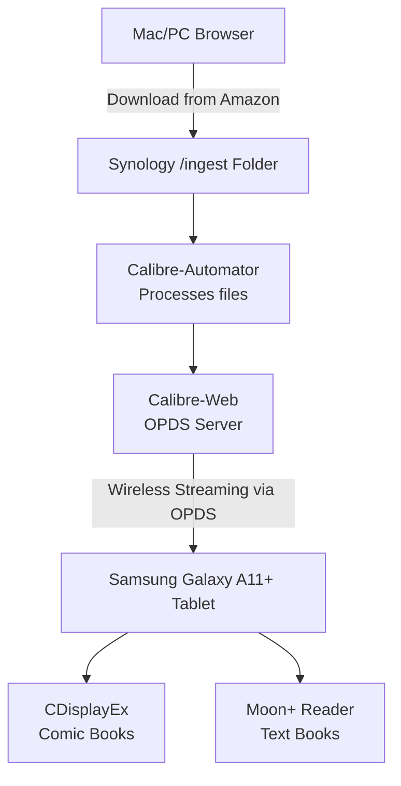

# Kid-Safe Kindle Comic Pipeline (Synology + Portainer)

Securely share your Amazon Kindle comic collection with your kid on a Samsung Galaxy A11+ tablet, bypassing the Kindle app entirely to prevent accidental 1-Click purchases.

---

## Architecture



---

## Step 1: Prepare Synology Folders

Create the following directories in File Station:

- `/volume1/docker/calibre/config` — app config and database
- `/volume1/docker/calibre/library` — permanent sorted library
- `/volume1/docker/calibre/ingest` — drop folder for new files

---

## Step 2: Deploy Portainer Stack

The compose file lives at `ansible/services/cerebro/30-calibre/compose.yaml`. Deploy it as a new Stack in Portainer. Update `PUID`, `PGID`, and `TZ` before deploying.

`DOCKER_MODS` installs Calibre inside the container for book processing and conversion — required for auto-ingest to work.

```yaml
services:
  calibre-web-automated:
    image: crocodilestick/calibre-web-automated:latest
    container_name: calibre-web-automated
    environment:
      PUID: "1026"
      PGID: "100"
      TZ: "America/Phoenix"
      DOCKER_MODS: "lscr.io/linuxserver/mods:universal-calibre"
    volumes:
      - /volume1/docker/calibre/config:/config
      - /volume1/docker/calibre/library:/calibre-library
      - /volume1/docker/calibre/ingest:/cwa-book-ingest
    ports:
      - 8083:8083
    restart: unless-stopped
```

---

## Step 3: First-Time Server Configuration

1. Open `http://[YOUR_SYNOLOGY_IP]:8083` in a browser.
2. Set the library location to `/calibre-library` and click Save.
3. Log in with default credentials (`admin` / `admin123`) — change the password immediately.
4. Go to **Admin > Manage Users > Add New User** and create a restricted profile for your child with "Allow Uploads" and "Allow Admin Rights" both unchecked.

---

## Step 4: Configure Tablet Apps

### CDisplayEx (Comics & Graphic Novels)

1. Menu → **Network / Digitals** → **Add a Feed / OPDS Catalog**
2. URL: `http://[YOUR_SYNOLOGY_IP]:8083/opds` — use your child's Calibre-Web login

### Moon+ Reader (Books & Character Guides)

1. Top-left menu → **Net Library** → **Add New Catalog**
2. Same URL: `http://[YOUR_SYNOLOGY_IP]:8083/opds`

---

## Daily Workflow

1. **Download** — log into Amazon, go to Content & Devices, and download the EPUB/PDF for the comic (if the publisher allows it). If DRM-locked, route through the desktop Calibre app with the DeDRM plugin first.
2. **Drop** — move the file into `/volume1/docker/calibre/ingest` on the Synology.
3. **Automatic** — `calibre-automator` picks it up, adds it to the library, and clears the ingest folder.
4. **Read** — your child opens CDisplayEx or Moon+ Reader, refreshes the network catalog, and downloads the comic.
